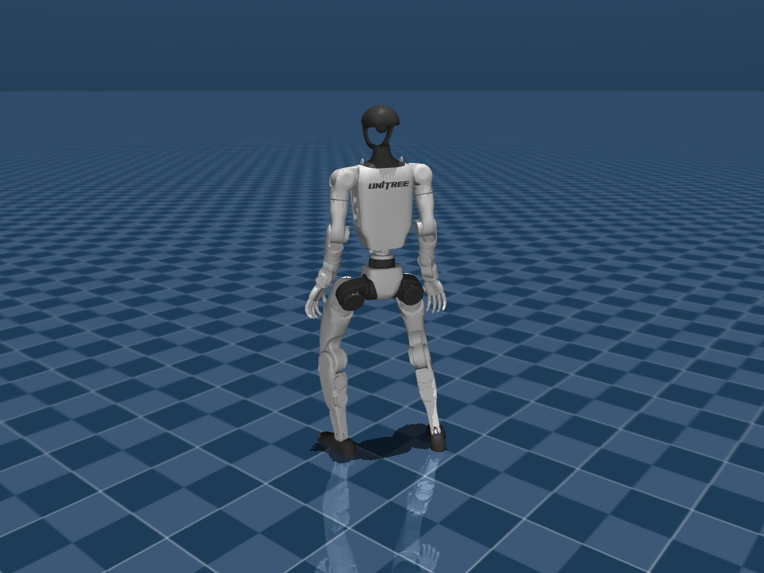

# M2@9999 部署验证（2026-09-24）

M2 已接入一行切换配置，接口与仿真恢复验证完成。**尚不建议直接据此批准真机：发现站立后左手抵住大腿、左肩roll持续高力矩的问题；逐关节AMP负载筛选未通过。** 本次仅离线控制器和CPU MuJoCo仿真，没有启动DDS或真机控制。

## 切换候选

编辑 [smp_recovery.yaml](../policy/smp_recovery/config/smp_recovery.yaml)，只改：

```yaml
profile: m2_9999
```

当前默认仍为 `ec7_9000`。新增候选不改变已有默认，也没有改变Kp/Kd、动作缩放或限幅。修改profile后须重启部署进程；环境变量 `SMP_RECOVERY_PROFILE` 优先于YAML。仿真可以临时指定：

```bash
cd /home/luyd/workspace/RoboMimic_Deploy
SMP_RECOVERY_PROFILE=m2_9999 /home/luyd/miniconda3/envs/robomimic/bin/python deploy_mujoco/deploy_mujoco.py
```

M2来源：`formal_20260923_v2/M2_A6_mix/model_9999.pt`，actor父代A6@9999。源checkpoint SHA：`291d194dc13bf085e974b84a0b868517b07710d34dc0ceae83dcc03c7d3afb61`。

ONNX SHA：`36e020d90e6b842482701d7038d4ea49fd1f5eaac237dccbdbc41fdbb31c7cca`。93D观测、29D动作、内置原checkpoint normalizer。512组输入最大误差4.77e-6；实际SmpRecovery enter/run通过；8项控制字段与训练部署合同一致，29关节顺序一致。原有profile/model SHA与tau_est、dq、PD估算力矩、温度等日志机制沿用，功率可由tau_est*dq计算；电机估计力矩不同于实际测力。

## 完整配对结果

CPU MuJoCo 3.2.3，2ms物理步、20ms控制步，每次20秒。nominal为四方向各16个固定程序化初态，共64例；每个扰动条件采用其中四方向各前4个，共16例。三候选完全相同初态，AMP重新运行同64例。共496回合，无数值异常。通过标准是连续满足原严格站立条件10秒。

|条件|R2@9000|A6@9999|M2@9999|
|---|---:|---:|---:|
|标准平地|64/64|64/64|64/64|
|上身质量/惯量×1.3|16/16|16/16|16/16|
|实际电机Kp/Kd×0.8|16/16|15/16|16/16|
|实际电机Kp/Kd×1.2|16/16|16/16|16/16|
|固定10ms命令延迟|16/16|16/16|16/16|
|上身×1.3＋增益×0.8＋10ms延迟|15/16|13/16|15/16|

上身指torso_link及其后代（含双臂），质量和惯量一起缩放。电机误差仅施加到物理PD，主机目标限幅仍用名义参数；延迟只作用于位置命令队列。这是固定端点压力测试，没有随机扫描全部0–10ms，也未覆盖板下、自然低位reset、摩擦变化或push。R2重新运行64例的峰值与原评测逐例完全一致。

AMP 64/64达到直立，9/64满足严格连续站稳10秒，不应解读为仅9次起身。

## 标准平地负载

先每条轨迹跨关节/物理子步取峰值，再跨64例取P95。功率为单关节机械abs(tau*dq)，不是整机电功率。

|策略|力矩峰值P95 Nm|速度峰值P95 rad/s|功率峰值P95 W|最长连续>90%限幅时长P95 s|
|---|---:|---:|---:|---:|
|ft_r2_9000|101.64|11.02|496.37|0.50|
|path_a6_9999|139.00|13.32|914.41|0.34|
|m2_9999|110.09|12.53|834.37|2.57|
|amp|139.00|37.87|1720.53|0.24|

M2全身三个峰值低于A6和AMP，但超过R2，不能用全身汇总抵消局部负载。逐关节P95的代表性超出：

|关节／指标|M2|AMP|
|---|---:|---:|
|左髋yaw功率 W|834.37|451.79|
|右踝roll力矩 Nm|50.00|29.04|
|腰pitch速度 rad/s|11.14|8.92|
|左肩roll最长连续高力矩 s|2.57|0.09|

这里的高力矩是绝对力矩超过该关节90%限幅，不直接等于堵转或过流。需结合关节速度、接触和电流/温度。完整逐关节数据在 [证据](recovery_m2_validation/amp_joint_exceedances.json)。

## 左肩持续用力：已经定位到接触

例：标准平地 `prone_13`，约3.36–6.04秒左肩roll高力矩累计2.672秒，最长连续2.66秒。此时头高约1.23m、肩速度中位数约0.028rad/s，已经进入站立阶段。4秒时实际肩角0.159rad，actor原始目标约-1.616rad，实际力矩-25Nm。冻结状态重算接触显示左手与左大腿接触约75N（单帧诊断值，不是全程峰值），支持“持续向身体内侧压手”的解释。



不能仅因机械功率低而忽略这种低速高力矩。建议先在仿真处理站立后肩部目标与自接触，再复测恢复和脱困；本次保留原策略与控制参数作为可复现基线，没有静默加入保护或改写动作。

## 视频与复现

视频每段20秒原速；列R2/A6/M2，行仰卧/伏卧/左侧/右侧，固定选每方向00号，不按成功挑样例。

- [标准平地对照](/home/luyd/workspace/RoboMimic_Deploy/outputs/recovery_candidates/m2_deploy_20260924/videos/nominal_R2_A6_M2_20s.mp4)
- [上身增重30%对照](/home/luyd/workspace/RoboMimic_Deploy/outputs/recovery_candidates/m2_deploy_20260924/videos/upper130_R2_A6_M2_20s.mp4)

```bash
cd /home/luyd/workspace/RoboMimic_Deploy
OPENBLAS_NUM_THREADS=1 OMP_NUM_THREADS=1 /home/luyd/miniconda3/envs/robomimic/bin/python tools/validate_recovery_stress.py \
  --cases outputs/recovery_candidates/paired_flat64/paired_cases.json \
  --out outputs/recovery_candidates/m2_deploy_repeat --workers 8
```

逐例JSON、50Hz状态与观测、500Hz实际力矩/速度在 `outputs/recovery_candidates/m2_deploy_20260924`。本次汇总和协议见 [summary](recovery_m2_validation/summary.json)、[protocol](recovery_m2_validation/protocol.json)。高负载累计与最长连续时长分开保存，有限值和MuJoCo状态警告均检查。
