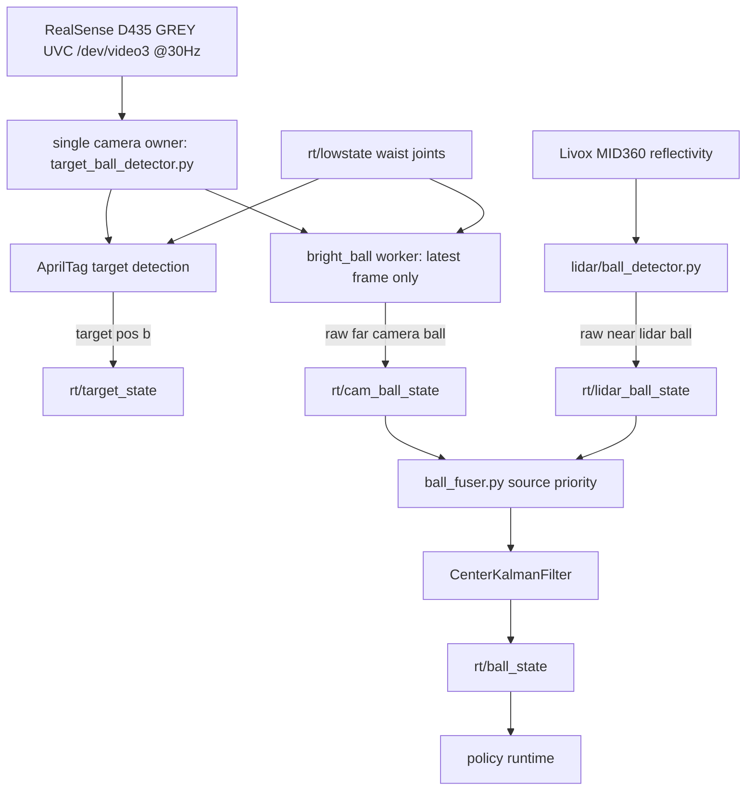

# Camera Perception Architecture

This document describes the runtime architecture for grayscale camera target
detection, camera ball detection, lidar ball detection, and final ball fusion.

## Runtime Pipeline



## Topic Ownership

- `rt/target_state` is published by the camera AprilTag service.
- `rt/cam_ball_state` is a raw camera ball observation topic.
- `rt/lidar_ball_state` is a raw lidar ball observation topic.
- `rt/ball_state` is published only by `onboard/perception/ball_fuser.py`.

The final ball source priority is `lidar > camera`. The chosen raw observation
feeds one final `CenterKalmanFilter`, so camera far-range detections and lidar
near-range detections share the same smoothed output used by policy.

## Grayscale Camera Performance Rules

- Keep the V4L2 `GREY` frame as a single-channel image for AprilTag and
  bright-ball detection. Convert to BGR only for preview or recording.
- Use latest-frame semantics for worker handoff. The bright-ball worker queue is
  bounded to one frame and drops stale frames when detection falls behind.
- Keep preview optional and throttled. `--preview-max-hz` limits MJPEG encoding,
  which can otherwise steal time from detection.
- Keep terminal output throttled. `--status-hz` avoids per-frame flush jitter.
- Use `--profile-timing` to print mean/p95 stage timing over
  `--profile-window` frames.

## Launch

Run grayscale camera target + bright-ball perception:

```bash
bash onboard/perception/camera/run_gray.sh
```

Also start the final ball fuser:

```bash
bash onboard/perception/camera/run_gray.sh --with-fuser
```

Run lidar raw ball detection:

```bash
python onboard/perception/lidar/ball_detector.py
```

Run the fuser separately:

```bash
bash onboard/perception/run_ball_fuser.sh
```

Profiling example:

```bash
bash onboard/perception/camera/run_gray.sh \
    --profile-timing \
    --profile-window 30 \
    --preview-max-hz 10 \
    --status-hz 4
```

Hardware validation should confirm `rt/target_state`, `rt/cam_ball_state`,
`rt/lidar_ball_state`, and final `rt/ball_state` are all published at the
expected rates before policy is started.
